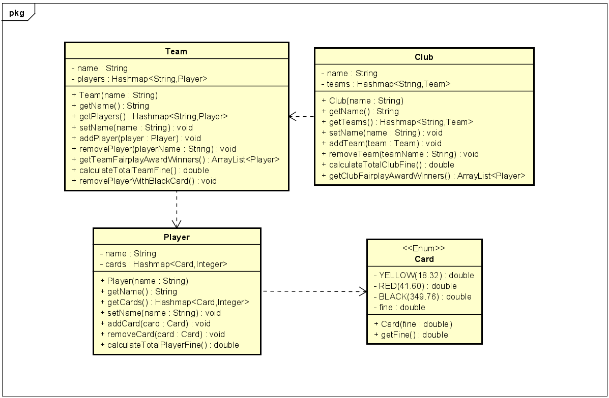

# Start Document for Soccer Assignment 

---
###  Name: Jadyn Jacques
### Student Number: 4977920

---

## Problem Statement

FC Emmen, the local soccer club of Emmen, requires an application to monitor the number of fouls committed by players in each team. Each team consists of a minimum of 11 players, and the club manages multiple teams. The application should record the count of yellow, red, and black cards for every player. Each card incurred by a player results in a fine. The fines for different cards are as follows: €18.32 for a yellow card, €41.60 for a red card, and €349.76 for a black card. In case of a black card, the player is disqualified from playing for the team in the future. The club needs to determine the total amount of money it owes to the National Soccer Association as a result of these fines. Additionally, the application should identify the player with the least number of cards and award them the Fairplay Award.

---

## Inputs and Outputs

### Inputs

| Case           | Type     | Condition  |
|----------------|----------|------------|
| Name of player | `String` | `Not NULL` |
| Name of team   | `String` | `Not NULL` |
| Name of Club   | `String` | `Not NULL` |  

### Outputs

| Case                                     | Type                | Condition     |
|------------------------------------------|---------------------|---------------|
| Name of the player                       | `String`            | `Not NULL`    |
| Name of the team                         | `String`            | `Not NULL`    |
| Name of the club                         | `String`            | `Not NULL`    |
| List of players in the team              | `Hashmap<Player>`   | `Not NULL`    |
| List of teams in the club                | `Hashmap<Team>`     | `Not NULL`    |
| List of cards a player has accumulated   | `Hashmap<CardType>` | `Not NULL`    |
| Fine amount per card                     | `Double`            | `Number` >= 0 |
| Fine amount owed per player              | `Double`            | `Number` >= 0 |
| Fine amount owed per team                | `Double`            | `Number` >= 0 |
| Total fine amount owed by the club       | `Double`            | `Number` >= 0 |
| Player receiving the Team Fairplay Award | `Player`            | `Not NULL`    | 
| Player receiving the Club Fairplay Award | `Player`            | `Not NULL`    | 

### Calculations

| Case                                     | Calculations                                                                                                |
|------------------------------------------|-------------------------------------------------------------------------------------------------------------|
| Fine amount owed per player              | Sum of the fines for all the yellow, red, and black cards received by the player                            |
| Fine amount owed per team                | Sum of the fines of all the players of that team                                                            |
| Total fine amount owed by the club       | Sum of the fines accumulated by each team                                                                   |
| Player receiving the Team Fairplay Award | Comparison between each player of `that specific` team to see who has the smallest sum of cards accumulated |
| Player receiving the Club Fairplay Award | Comparison between each player of `each` team to see who has the smallest sum of cards accumulated          |

---

## Class Diagram

--- 

## Test Data and Test Cases

### Test Data

#### Player

| Player Name | Yellow Card | Red Card | Black Card | 
|-------------|-------------|----------|------------|
| Alex        | 2           | 1        | 0          | 
| Jadyn       | 1           | 0        | 1          | 
| Nico        | 0           | 1        | 0          |

 

#### Team

| Team Name     | Players                |
|---------------|------------------------|
| Senior Team   | Jadyn, Alex            |
| Junior Team   | Nico                   |
| Team Test     | P1, P2, P3, ....., P22 | 

 

#### Club

| Club Name            | Teams                    |
|----------------------|--------------------------|
| FC Emmen Futbol Club | Senior Team, Junior Team |

 

### Test Cases

#### Test Case 1: Removing more than 11 players from a team

| Action                           | Expected Output                                                         |
|----------------------------------|-------------------------------------------------------------------------|
| seniorTeam.removePlayer("Jadyn") | "Cannot remove more players. Team is at the minimum required capacity." |

 

#### Test Case 2: Adding more than 22 players to a team

| Action                   | Expected Output                                                 |
|--------------------------|-----------------------------------------------------------------|
| teamTest.addPlayer(Nico) | "Cannot add more players. Team is already at maximum capacity." |

 

#### Test Case 3: Calculating Fine for a Player

| Action                     | Expected Output                                                                 |
|----------------------------|---------------------------------------------------------------------------------|
| CalculateTotalPlayerFine() | Alex's Fine: `€78.24`   Jadyn's Fine: `€368.08`   Nico's Fine: `€41.60` |

 

#### Test Case 4: Calculating Fine for a Team

| Action                   | Expected Output                                                 |
|--------------------------|-----------------------------------------------------------------|
| CalculateTotalTeamFine() | Senior Team's Fine: `€446.32`   Junior Team's Fine: `€41.60` |

 

#### Test Case 5: Calculating Total Fine for the Club

| Action                   | Expected Output            |
|--------------------------|----------------------------|
| CalculateTotalClubFine() | Total Club Fine: `€487.92` |

 

#### Test Case 6: Checking for said Team's Fairplay Award Winner(s)

| Action                        | Expected Output                                                                                 |
|-------------------------------|-------------------------------------------------------------------------------------------------|
| getTeamFairplayAwardWinners() | Senior Team's Fairplay Award Winners: `Jadyn`   Junior Team's Fairplay Award Winner: `Nico` |

 

#### Test Case 7: Checking for the Club's Fairplay Award Winner(s)

| Action                        | Expected Output                       |
|-------------------------------|---------------------------------------|
| getClubFairplayAwardWinners() | Club's Fairplay Award Winners: `Nico` |

 

#### Test Case 8: Removing Players with Black Cards

| Action                      | Expected Output                                                                       |
|-----------------------------|---------------------------------------------------------------------------------------|
| removePlayerWithBlackCard() | Senior Team: `Players removed: Jadyn`   Junior Team: `No player has a Black card` |

Please note that the function output is void but the above highlighted text appears in the Console

